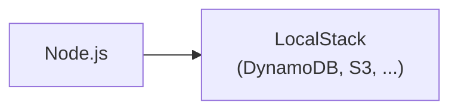
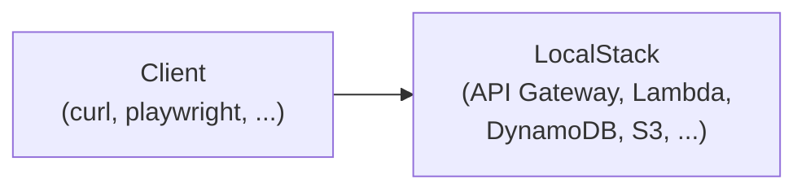

# todoapp-lambda

*[English version](README.md)*

これは Lambda + TypeScript + LocalStack + DynamoDB を使ったバックエンドのサンプルである。

## 長所と短所

この構成は、以下のような特長をもっている:

- なじみの (vitestを使った) TDD の作業手順が使える。
- オーバーヘッドは最小限。
- 本物 (っぽい) DynamoDB や S3 を使った統合テストが可能。
- API Gateway 経由の E2E テストが可能。
- 統一された IaC (同一の Terraform をローカル環境にも本番環境にも適用可)

制限事項:

- サポートしているのは JavaScript (TypeScript) だけ。
- Lambda Layers は使わない。
- 使える AWS のサービスは限られている (DynamoDB, S3, SQS, など)。

### <a href="https://docs.aws.amazon.com/serverless-application-model/latest/developerguide/what-is-sam.html">AWS SAM</a> や <a href="https://github.com/terraform-aws-modules/terraform-aws-lambda/tree/master">Serverless.tf</a>等を使わない理由

AWS SAM は多様なユースケース・言語をサポートする複雑なフレームワークであり、CloudFormation の利用を前提としている。
また、ローカル環境におけるテストは<a href="https://docs.aws.amazon.com/lambda/latest/dg/testing-guide.html#best-practices-for-testing">あまりサポートされていない</a>。
Serverless.tf はすべて Terraformを使って行っており、アクロバット的。
いっぽうで、必要なのは TypeScript をコンパイルして zip ファイルを作ることであって、これだけなら <a href="https://docs.aws.amazon.com/lambda/latest/dg/typescript-package.html#aws-cli-ts">数ステップで可能</a>。
そのために巨大なフレームワークは必要ない。

## アーキテクチャ

開発時 (単体テスト / 統合テスト):



ローカル環境へデプロイ (E2E テスト):



## 本リポジトリの内容

```
todoapp-lambda/
  ├── README.md                 # このファイル。
  ├── Makefile                  # 補助スクリプト。
  ├── docker-compose.yml        # LocalStack用。
  ├── .nvmrc                    # Node.jsのバージョン。
  ├── terraform/                # IaC。
  │   ├── Makefile
  │   ├── main.tf
  │   ├── provider.tf
  │   ├── iam.tf
  │   └── modules/              # Terraformモジュール。
  │       └── ...
  ├── app/                      # サンプルTODOアプリ。
  │   ├── Makefile
  │   ├── biome.json
  │   ├── package-lock.json
  │   ├── package.json
  │   ├── src/                  # ソースコード (TypeScript)。
  │   │   ├── index.test.ts
  │   │   └── index.ts
  │   ├── e2e/                  # E2E テスト。
  │   │   └── app.test.ts
  │   └── tsconfig.json
  └── tools/                    # 各種補助スクリプト。
      ├── awslocal
      ├── tflocal
      ├── get_function_url.sh
      └── get_rest_api_url.sh
```

## 必要なもの

- Node.js
- Docker
- Terraform
- LocalStack

## 開発・テストするには

```shell
$ docker compose up
...
$ make test    # テスト実行
$ make lint    # Lintおよび整形
$ make clean   # クリーンアップ
$ make deploy  # LocalStackにデプロイ
```

Lambdaの実行ログは LocalStack上に保存されている:

```shell
$ cd app/
$ make tail SINCE=2h  # 過去2時間のログを表示。
```

## AWSにデプロイするには

まず、Terraform状態管理用のS3バケットを作成する。
バケット名は一意である必要がある。

```shell
$ aws s3 mb s3://my-terraform-state
```

次に、AWS上のリソースを初期化する
(この時点ではまだコードはデプロイされない) :

```shell
$ cd terraform/
$ make init STATE_BUCKET=my-terraform-state
$ make plan
$ make apply
```

そしてコードをデプロイする:

```shell
$ cd app/
$ make deploy AWSCLI=aws
```

Lambdaの実行ログは CloudWatch上に保存されている:

```shell
$ cd app/
$ make tail AWSCLI=aws
```

## バグ・TODOなど

- CI/CD サポートはまだ不完全。
