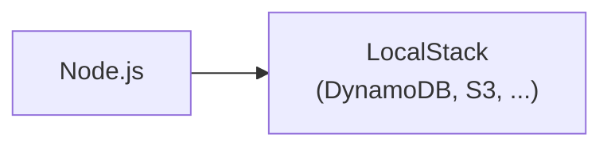
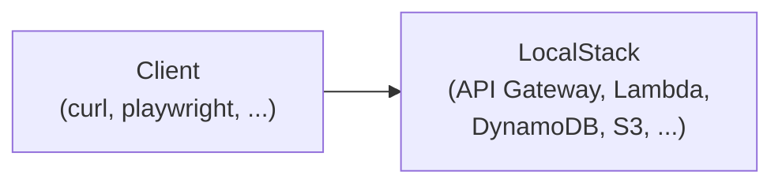

# todoapp-lambda

This is a sample backend with Lambda + TypeScript + LocalStack + DynamoDB.

## Pros and Cons

This setup allows:

- Familiar TDD workflow (w/ vitest).
- Minimal overhead.
- Integration tests using real(-ish) DynamoDB and S3.
- E2E tests via API Gateway.
- Uniform IaC. (You can apply the same Terraform to LocalStack and AWS.)

Limitations:

- Only supports JavaScript (TypeScript).
- No support of Lambda Layers.
- Limited support of AWS services (DynamoDB, S3, SQS, etc).

### Why not using <a href="https://docs.aws.amazon.com/serverless-application-model/latest/developerguide/what-is-sam.html">AWS SAM</a>, <a href="https://github.com/terraform-aws-modules/terraform-aws-lambda/tree/master">Serverless.tf</a>, etc?

AWS SAM is a big framework that covers a variety of use cases / languages, and it requires to use CloudFormation. 
Their support for local testing is <a href="https://docs.aws.amazon.com/lambda/latest/dg/testing-guide.html#best-practices-for-testing">poor</a>.
Serverless.tf does everything with Terraform, which seems acrobatic.
Meanwhile, all you need is to compile a TypeScript code and create a zip file.
This is a relatively simple task that can be done with <a href="https://docs.aws.amazon.com/lambda/latest/dg/typescript-package.html#aws-cli-ts">a few commands</a>.
You don't need a big dependency for this.

## Architecture

Development (Unit tests / Integration tests):



Deploy to Local (E2E tests):



## Contents

```
todoapp-lambda/
  ├── README.md                 # This file.
  ├── Makefile                  # Helper scripts.
  ├── docker-compose.yml        # For LocalStack.
  ├── .nvmrc                    # Node.js version.
  ├── terraform/                # IaC.
  │   ├── Makefile
  │   ├── main.tf
  │   ├── provider.tf
  │   ├── iam.tf
  │   └── modules/              # Terraform modules.
  │       └── ...
  ├── app/                      # Sample TODO app.
  │   ├── Makefile
  │   ├── biome.json
  │   ├── package-lock.json
  │   ├── package.json
  │   ├── src/                  # Source code (TypeScript).
  │   │   ├── index.test.ts
  │   │   └── index.ts
  │   ├── e2e/                  # E2E tests.
  │   │   └── app.test.ts
  │   └── tsconfig.json
  └── tools/                    # Helper scripts.
      ├── awslocal
      ├── tflocal
      ├── get_function_url.sh
      └── get_rest_api_url.sh
```

## Prerequisites

- Node.js
- Docker
- Terraform
- LocalStack

## How to Develop / Test

```shell
$ docker compose up
...
$ make test    # run tests
$ make lint    # run linter
$ make clean   # cleanup files
$ make deploy  # deploy to LocalStack
```

How to show the execution logs:

```shell
$ cd app/
$ make tail SINCE=2h  # show logs of last 2 hours.
```

## How to Deploy to AWS

```shell
$ cd terraform/
$ terraform init && terraform plan && terraform apply
...
$ cd app/
$ make deploy AWSCLI=aws AWS_REGION=ap-northeast-1 
```

How to show the execution logs:

```shell
$ cd app/
$ make tail AWSCLI=aws AWS_REGION=ap-northeast-1
```

## Bugs / TODOs

- CI/CD support is incomplete.
