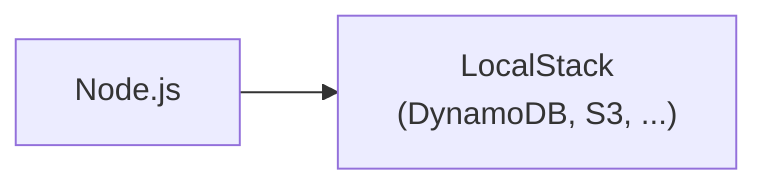
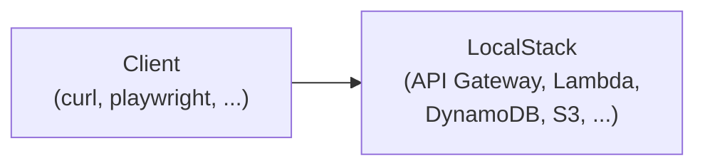

# todoapp-lambda

This is a sample backend with Lambda + TypeScript + LocalStack + DynamoDB.

## Pros and Cons

This setup allows:

- The familiar TDD workflow (w/ vitest).
- Integration tests using real(-ish) DynamoDB and S3.
- Minimal overhead. (There are only thin wrappers.)
- E2E tests via API Gateway. (E2E tests are not included in this repo.)

Limitations:

- Only supports JavaScript (TypeScript).
- Limited support of AWS services (DynamoDB, S3, SQS, etc).

## Architecture

Development (Unit tests / Integration tests):



Deploy to Local (E2E tests):



## Contents

- `README.md`: This file.
- `docker-compose.yml`: Docker compose file for LocalStack.
- `Makefile`: Helper scripts.
- `terraform/`: Infrastructure code.
  - Can be applied to LocalStack and a real AWS account.
- `todo/`: A sample TODO app.
  - `src/`: Source code (TypeScript).
  - `biome.json`: Biome settings..
  - `package.json`: Package dependency and helper scripts.
  - `package-lock.json`: Package lockfile.
  - `tsconfig.json`: TypeScript settings.
- `tools/`: Helper scripts.
  - `invoke_api.sh`: Script for API gateway.
  - `invoke_funcurl.sh`: Script for Lambda Functional URL.

## Prerequisites

- Node.js
- Docker
- Terraform
- `awslocal` package (`brew install awscli-local`)

## How to Develop / Test

```shell
$ docker compose up
...
$ make test    # run tests
$ make lint    # run linter
$ make clean   # cleanup files
$ make deploy  # deploy to LocalStack
```

## How to Deploy to AWS

```shell
$ cd terraform/
$ terraform init && terraform plan && terraform apply
$ cd ../
$ make deploy AWSCLI=aws AWS_REGION=ap-northeast-1 
```
