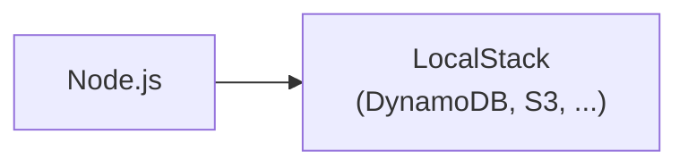
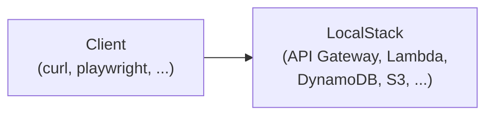

# todoapp-lambda

This is a sample backend with Lambda + TypeScript + LocalStack + DynamoDB.

## Pros and Cons

This setup allows:

- Familiar TDD workflow (w/ vitest).
- Minimal overhead. (There are only thin wrappers.)
- Integration tests using real(-ish) DynamoDB and S3.
- E2E tests via API Gateway. (E2E tests are not included in this repo.)

Limitations:

- Only supports JavaScript (TypeScript).
- Limited support of AWS services (DynamoDB, S3, SQS, etc).

## Architecture

Development (Unit tests / Integration tests):



Deploy to Local (E2E tests):



## Contents

```
todoapp-lambda/
├── README.md                 # This file.
├── Makefile                  # Helper scripts.
├── docker-compose.yml        # For LocalStack.
├── terraform                 # IaC.
│   ├── Makefile
│   ├── apigateway.tf
│   ├── ...
│   └── provider.tf
├── todo                      # Sample TODO app.
│   ├── Makefile
│   ├── biome.json
│   ├── package-lock.json
│   ├── package.json
│   ├── src                   # Source code (TypeScript).
│   │   ├── index.test.ts
│   │   └── index.ts
│   └── tsconfig.json
└── tools                     # Helper scripts.
    ├── invoke_api.sh
    └── invoke_funcurl.sh
```

## Prerequisites

- Node.js
- Docker
- Terraform
- `awslocal` package (`brew install awscli-local`)

## How to Develop / Test

```shell
$ docker compose up
...
$ make test    # run tests
$ make lint    # run linter
$ make clean   # cleanup files
$ make deploy  # deploy to LocalStack
```

## How to Deploy to AWS

```shell
$ cd terraform/
$ terraform init && terraform plan && terraform apply
...
$ cd ../
$ make deploy AWSCLI=aws AWS_REGION=ap-northeast-1 
```

## Bugs / TODOs

- Terraform code needs a bit of more reworking.
